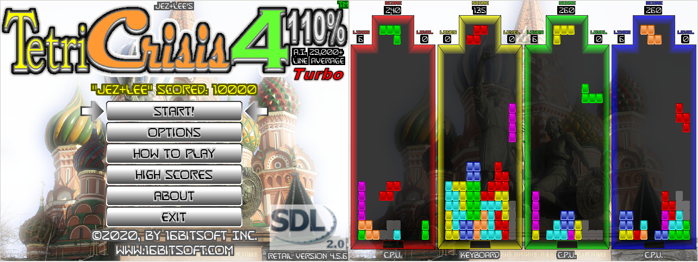

# TetriCrisis_4_110Percent_A.I._Turbo
100% FREE Open-Source Cross-Platform C++/SDL2 Tetris Remake!

_______________________________________________________________________________________________________
FEATURES:

- Absolutely 100% FREE With No Advertisements & No In-App Purchasing!
- Runs 100% On ANY Supported 64Bit Windows Or Linux Desktop Or Laptop
- Game Is A 100% Perfect Nintendo Gameboy Port Of The Classic Original
- Beautiful Full Color And High Resolution Visual Graphics
- Awesome Multi-Channel Digital Sound Effects
- Amazing Digital Music Soundtrack By “D.J. Fading Twilight”
- Easy To Play Keyboard, Mouse, And/Or USB Gamepad(Three Max) Controls
- Play Against Up To Three Other Friends Or Aggressively Smart Artificial Intelligence Computer Players
- Six Amazing Game Modes Including: “Original” & The New “Crisis+Mode”
- Saved High Score Table For Each Game Mode
- Completely Configurable Saved Game Options

_______________________________________________________________________________________________________
ENJOY!